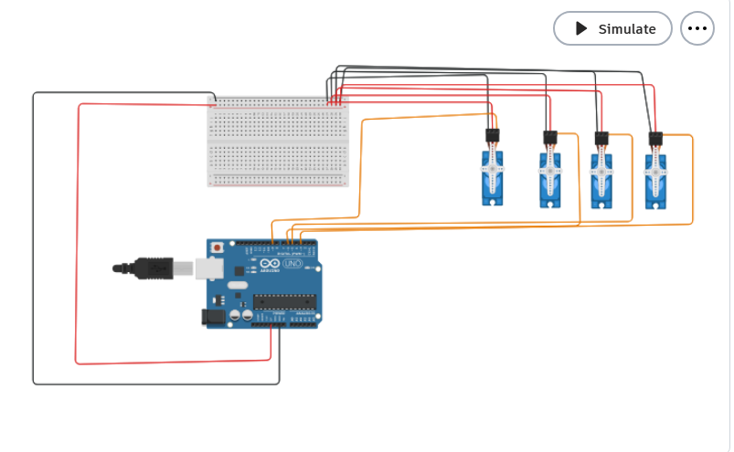

# Arduino Multi-Servo Control Project 🤖

This project is a practical application of embedded systems programming, demonstrating how to control and synchronize four servo motors simultaneously using an **Arduino Uno**. The project involves a timed sequence where the motors sweep back and forth before locking into a central position.

## 🧠 Circuit Design & Simulation

Before running the code on physical hardware, the circuit was designed and simulated to ensure correct wiring and logic:

1. Added an **Arduino Uno** and a standard **Breadboard** to the workspace.
2. Placed four **Micro Servo motors** (`s1, s2, s3, s4`).
3. Connected the 5V and GND pins from the Arduino to the breadboard power rails to distribute power to all four servos.
4. Attached the PWM (Pulse Width Modulation) signal wires of the servos to Arduino digital pins **3, 5, 6, and 9**.
5. Implemented the C++ code to control the movement timing using the `millis()` function instead of standard delays to track elapsed time accurately.

---

## 📁 Repository Structure
* `servo_control.ino`: The main Arduino C++ sketch containing the logic for the servo motors.
* `image_7daed1.png`: The visual schematic showing the wiring connections between the Arduino, breadboard, and servos.

## 🛠 Prerequisites
To build and run this project, you will need the following:

**Hardware:**
* 1x Arduino Uno
* 4x Servo Motors (e.g., SG90)
* 1x Breadboard
* Jumper Wires

**Software:**
* [Arduino IDE](https://www.arduino.cc/en/software) installed on your computer (or an account on Tinkercad for web simulation).
* The built-in `<Servo.h>` library (comes pre-installed with the Arduino IDE).

## 🚀 How to Run
1. Wire up the components exactly as shown in the schematic image provided.
2. Connect your Arduino Uno to your computer using a USB cable.
3. Open the **Arduino IDE** and create a new sketch.
4. Copy the project code and paste it into the IDE. *(Note: Ensure you add the two closing curly braces `} }` at the very end of your script to close the `else` statement and the `loop()` function).*
5. Go to **Tools > Board** and select **Arduino Uno**.
6. Go to **Tools > Port** and select the port your Arduino is connected to.
7. Click the **Upload** button to compile and flash the code to the microcontroller.

## 📊 Expected Behavior (Results)
Once the code is uploaded (or the simulation is started), the system will behave as follows:

* **Initial Phase (0 - 2 Seconds):** The internal timer starts. All four servos will sweep synchronously from 0 to 180 degrees, and then back from 180 to 0 degrees in steps of 2 degrees.
* **Lock Phase (After 2 Seconds):** Once 2000 milliseconds have elapsed, the sweeping motion completely stops, and all four servos immediately move to and lock at exactly the **90-degree** (center) position.
